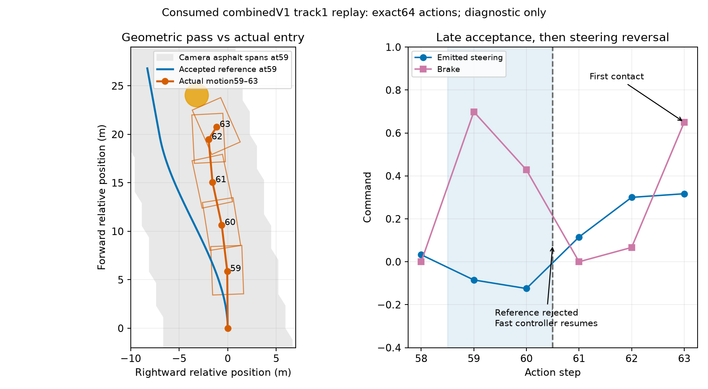

# Combined V1 first-contact diagnosis

This is a **consumed mandatory trace diagnostic**, not a new validation lap.
Frozen combined source SHA256
`31059f6d3e4906199d8a703aa46e9c5d76df529ef207296d61f6f7c1bf24ce52`
was replayed on track 1, seed 516237, for 64 actions. Every action matched its
original receipt exactly; replay stopped at first contact, step 63, under the
declared maximum of 100 actions. No inference source was changed.

## Observed sequence

| Step | Selected | Actual speed before | Steering / brake | Current pass status |
|---:|---|---:|---|---|
| 58 | Fast | 82.17 m/s | +0.0328 / 0 | Fast sees circle at 30.86 m; hazard bbox absent |
| 59 | Hazard | 83.67 m/s | −0.0847 / 0.6988 | New left pass, peak curvature 0.08860 /m, target 46.31 m/s |
| 60 | Hazard | 67.58 m/s | −0.1247 / 0.4280 | Same committed curve, camera road margin 1.296 m and circle margin 1.200 m |
| 61 | Fast | 55.87 m/s | +0.1153 / 0 | Commitment rejects actual ego departure; hazard fallback proposed −0.1381 / 0.2382 |
| 62 | Fast | 56.79 m/s | +0.3001 / 0.0668 | Circle about 9.4 m ahead; hazard fallback target 18 m/s |
| 63 | Fast | 54.88 m/s | +0.3169 / 0.6500 | First contact, speed falls to 14.92 m/s |

The accepted curve is already undertracked before selection changes. Actual
post-action distance from its accepted world reference grows from 1.139 m at
59 to 2.247 m at 60. At camera 61 the transported reference lies 2.321 m left
of actual ego, exceeding the unchanged 1.5 m capture gate; heading error is
−0.293 rad, still within its 0.45 rad gate. Commitment correctly rejects.
The selector then chooses the fast controller, and emitted steering switches
from −0.1247 to +0.1153, the permitted +0.24 one-action slew. All steering
memories were synchronized; this is not an observed memory-sync defect.

## Dynamic entry mismatch

At first acceptance, the observed circle is only 23.81 m ahead and true speed
is 83.67 m/s. Reference peak curvature 0.08860 /m would demand 620.3 m/s² at
that speed, versus the declared 190 m/s² lateral budget. At only 1.5 m along
the reference, signed curvature is already −0.07485 /m; the route's tight
entry is not a distant future bend. Steering is therefore clipped to what the
current speed can support while braking attempts to reach the route's
46.31 m/s cap. The path does not establish that the vehicle can join it during
this transition.

Even a straight braking calculation at the declared 100 m/s² needs 24.28 m
to reach that cap, more than the observed circle distance before subtracting
vehicle/obstacle clearance. Actual brakes are stronger than that nominal
budget here, but braking and lateral response share tire force, and the
frontwheel actuator has lag. This diagnostic does not isolate their separate
contributions. At step 59 actual wheel angle changes from −0.0328 to +0.0847
radians during the action; body rightward yaw changes from +0.419 to −1.170
rad/s, far short of immediate reference curvature demand.

Camera geometry is not the primary rejection in this prefix: current cubic
fit residuals are only 0.14–0.24 m, all road supports are dense, same-circle
center errors against privileged diagnostics are 0.36–0.63 m, and accepted
road/circle margins exceed their gates. All four wheels remain on asphalt
before contact. Body sideslip stays below 0.033 rad (about 1.84°); no large
pre-contact body spin is observed. Rear wheel omega and individual tire
forces were not recorded, so tire-force allocation is not independently
identified.

## Conclusion and limits

The supported failure sequence is: accept a geometrically clear but
dynamically undertracked high-speed entry, leave the committed reference,
then select an opposing fallback while the same circle approaches. Geometric
acceptance and current steering synchronization alone do not make this
composition reachable. Retaining the hazard fallback might alter this result,
but no counterfactual episode was run and no finish claim follows. A future
change must address speed/curvature entry and handoff explicitly, with its own
test-first source and fresh validation. This lane made no selector retune,
lap grid or holdout run.

Independent read-only review verified the source/trace/diagnostic hashes,
all 64 exact actions, compact rows and reported calculations. It found no
evidence of a state synchronization defect in this prefix. The braking
comparison is illustrative, not a physical impossibility proof; neither
retaining hazard control nor steering reversal alone was tested as an isolated
cause or cure.

Evidence: `combined-v1-preview-causal.json`; full source-bound diagnostic and
camera frames under `.haic-artifacts/apex-speed-preview-combined-contact/`.
The reusable legal-camera fixture
`tests/fixtures/combined_v1_entry_camera.npz` contains only frames 58–61,
steps and parsed bbox metadata (8,333 bytes, SHA256
`569f0d38e2da59016468a3e9e14138593c06b41993c7441ee6d5ffb419db36ff`).
Actual motion/wheel/official-circle fields are explicitly privileged
development diagnostics and were never passed to inference.
