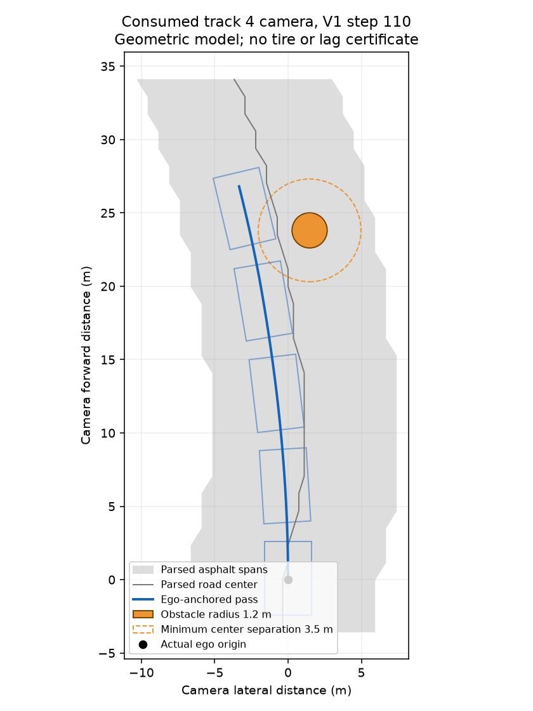

# Curved current-road pass study

`fast_preview_pass_agent.py` preserves V1 as a separate source and adds a
camera-model pass router. The original target remains four actual completed
laps at at most 13 seconds; the benchmark does not relax that goal.

Frozen source SHA256:
`aab01ed34d45b2741e307675580d0588026e7e109aec83d174b1b462b9d3f0a8`
(141,675 bytes). Parameters are `{}`. The complete V1 definitions are copied
exactly except renaming its public class `_BaseAgent`; the new public subclass
is appended. `preview-v2-lineage.json` and `preview-v2-source.patch` bind this
derivation. Root agent, previous inference sources and official physics remain
unchanged. The standalone ZIP is 28,951 bytes, SHA256
`f0d3c26f0ecfd4905a59cdf2b4b9aadf5027cf8ceb3ecad0da7d8d638363b666`;
its `agent.py` is byte-identical to the evaluated source.

## Reproduced V1 failure and camera probe

V1 track 4 contacted the obstacle at steps 141 and 143, simulation 11.36/11.52 s,
with target 18 m/s, steering −0.32 and speed 17.3→5.8→3.9 m/s before stalling.
An exact cold replay of the consumed required geometry reproduced all 146
actions through that scene. Thirty-six camera states were saved in ignored
artifacts. This replay is a diagnosis, not new validation or holdout.

The earlier step 110 camera exposes the routing opportunity: V1 emits
steer +0.02693 with target 47 and brake 0.28. A reset V2 static probe on the same
saved observation chooses a curved left pass, steer −0.03109, target 85 and
gas 0.4733 without braking. Its center polyline stays 4.004 m from the measured
obstacle center; the full vehicle envelope has road margin 2.578 m and circle
margin 1.170 m. These are geometric distances in the parsed camera model.
The already-imminent step 135/140 static cameras remain on inherited target 18;
this experiment attempts earlier route correction rather than teleporting
the car out of an existing close obstruction.

Exact observation hashes and outputs are in `preview-v2-camera-probe.json`.
Each V2 static probe resets independently, so it does not predict the new
policy's stateful driving outcome.

## Bounded geometry and control

A cubic fit to the current metric road constructs a smooth passing lane.
The Hermite entry starts at actual camera ego position 0 and heading 0; it
then follows the observed curved road through the pass, retaining the chosen
side while current geometry permits it. A residual or support gap rejects
branch jumps, sparse curves and unknown full-vehicle horizons.

Only a plan satisfying all checks replaces the legacy hazard action:

- Minimum center-to-circle separation 3.5 m over the complete sampled polyline.
- Oriented vehicle-to-circle clearance at least 0.75 m using official radius
  1.2 m, rather than a radius estimated from bright pixels.
- Full vehicle envelope within interpolated road spans, with at least 0.30 m
  margin. Polygon extrema are checked at all road and polygon breakpoints.
- Path curvature feasible under the physical 0.4-radian joint limit.

The conservative vehicle rectangle is longitudinal −2.4..2.6 m and lateral
±1.6 m. Independent review found that the narrower painted hull ±1.2 m missed
front wheel reach 1.568 m at maximum steering. A failing flat-road test reported
0.31 m hull margin while the wheel extended beyond the asphalt; the enlarged
envelope corrects that concrete footprint gap for road and circle checks.

Pursuit preview is capped at the active obstacle's distance. Speed retains
the existing 190 m/s² lateral bound and rear-grip gas budgets, capped by pass
cruise 85 and current/planned curvature. Steering slew uses the previous emitted
command, rather than applying a second slew after the inherited controller.
On invalid or unchecked geometry, inherited hazard pedals/targets remain.
An accepted new pass deliberately owns the new hazard steering and speed;
it can replace a legacy brake request that belonged to a different path.

Twenty-two focused tests pass, including 13 V1 camera regressions. Three
concrete failures were observed before correction: missing curved pass,
double steering slew, and missing steered-wheel footprint. Independent
read-only review confirms exact derivation, package imports, finite state and
algebraic geometry. The latest combined run reports 277 passes and two active
RED navigation-lane tests in `test_fast_path.py`; those files are outside this
candidate's ownership and the failures are preserved in the lineage record.

## Fresh mandatory screen

One fresh four-cell mandatory benchmark completed with frozen source and
parameters `{}`. `preview-v2-mandatory.json` retains exact source, environment,
parameter and action hashes. All operational error fields are null. No new
geometry or holdout was opened. This benchmark does not count as a complete
development rejection.

| Track, seed | Result | Contacts |
|---|---:|---:|
| 1, 516237 | 20.20 s | 0 |
| 2, 644062 | 26.08 s | 0 |
| 3, 1007 | 22.82 s | 0 |
| 4, 18800 | DNF, progress 0.51971 | 1 |

The three common finishes total 69.10 s, versus V1's 73.34 (5.78% shorter) and
fresh hybrid's 68.72 (0.55% longer). Track 2 improves on fresh hybrid by 0.12 s
and track 3 by 0.08, while track 1 remains 0.58 s slower. These gains do not rescue
mandatory completion or the 13-second goal. Track 4 has damage 0.2 and official
retirement `off_track`, with zero sampled full/partial road exits.

Its contact occurs at step 136, simulation 10.96 s. The preceding four actions
are already inherited steering −0.2267→−0.32 and target 18, with braking; speed
then drops 18.93→1.41 m/s. The static early-pass opportunity did not establish
that the closed-loop policy would retain a usable path at that later scene.

Sampled full road-exit counts are zero across all four tracks; partial counts
are 0/1/5/0. Measured local maxima are initialization 22.30 ms, reset 0.076 ms,
action 60.25 ms and RSS 97.96 MiB, within the stated runtime limits. These
samples do not exclude events between decisions, and runtime measurements do
not establish official container certification.

## Closed-loop diagnosis on the consumed geometry

A second diagnostic replay matches all 141 V2 actions through contact.
`preview-v2-closed-loop-replay.json` preserves the source hash, exact-prefix
verdict, mode counts and relevant camera-state decisions. It is diagnosis on
the already consumed mandatory geometry, not another validation result.

| V2 step | Camera road/path evidence | Resulting control |
|---|---|---|
| 110 | Obstacle 21.46 m away; planned peak curvature 0.0245/m | Curved pass, target 85, steer −0.062 |
| 111 | Remaining 16.46 m; revised peak curvature 0.0715/m | Curved pass, target 51.56, brake 0.240 |
| 112 | Left curvature0.15667/m exceeds joint limit0.13049/m | Inherited target 47 |
| 128 | Next obstacle 22.63 m away; road-fit residual 5.17 m | Inherited target 18 |
| 132 | Road-fit residual 4.81 m; visible horizon 17.64 m | Inherited target 18 |
| 136 | Near obstacle 4.997 m away | Contact and loss of motion |

Only seven of the first 141 actions use the new pass. Remaining distance
shrinks before tracking establishes the planned clearance, so replanning
demands sharper curvature. Later, the single-valued cubic cannot represent
the camera's hairpin branch and correctly refuses its unsupported road model.
This separates nominal geometric clearance from successful dynamic tracking;
loosening the residual gate would not establish a valid road representation.

## Remaining limits

The checks establish a geometric screen in interpolated camera coordinates.
They do not certify tire grip, steering lag, centroid error, occluded asphalt
or vehicle tracking of the planned curve. Only current visible obstacle boxes
enable the extension; occlusion returns to the inherited behavior. Finite
lookahead leaves future road unchecked, and branch rejection can keep a slow
legacy route. Static clearance evidence cannot establish successful laps.

**Original goal achieved: false; promoted: false.**
