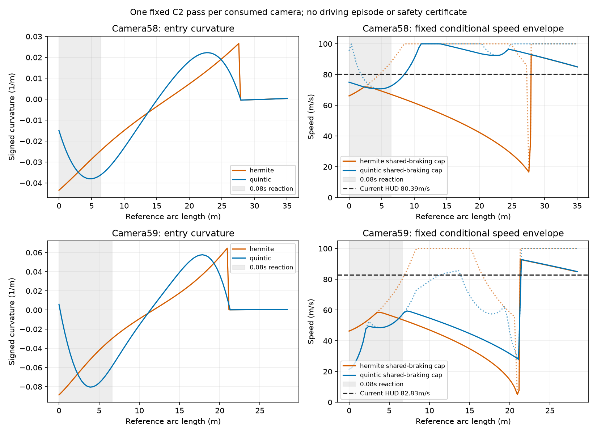

# Fixed C2 camera path study: negative

This offline diagnostic uses only consumed combined-V1 cameras 58/59, legal
HUD speed/yaw, accepted camera circle/bbox and the preceding emitted steering.
It makes no new controller or driving episode and uses no official world
position, map or simulator object as a path input. The frozen source remains
`31059f6d3e4906199d8a703aa46e9c5d76df529ef207296d61f6f7c1bf24ce52`.

## One construction per camera

Both constructions use the same current cubic road, left-side 4.0 m pass,
destination, join at circle distance minus 4 m, and end 3 m beyond the circle.
The comparison is the original cubic Hermite offset versus one normalized
quintic overall x(y). Quintic start conditions are position 0, heading 0 and
signed curvature HUD yaw / HUD speed; end conditions are the existing pass
position and road tangent/second derivative. It joins the same constant road
offset with C2 continuity. No side, parameter or trajectory grid was searched.
Mapping body yaw/speed to trajectory curvature assumes low sideslip; it is
not a camera measurement of velocity direction.

At camera 58 the fast detector sees a circle 30.86 m ahead. Its early floating
bbox is constructed from that camera centroid plus/minus the known 1.2 m
physical radius under the camera pixel scale. It is not a newly observed
hazard bbox; the original hazard detector has none there. Camera 59 uses its
already recorded current hazard bbox at 23.81 m. The diagnostic reports an
assumed one-pixel-per-axis center sensitivity of 0.941 m; this is not a
validated hard observation-error bound.

## Fixed dynamic model

Use a 0.08 s reaction interval, 190 m/s² combined force circle, 100 m/s²
longitudinal braking cap, 0.4 rad joint bound, 3 rad/s frontwheel motor rate and
0.24 rad per-action command slew. At speed v and reference curvature k,
available braking is the minimum of 100 and
`sqrt(max(0,190² − (v²*abs(k))²))`. A backward speed envelope solves that
coupled segment bound; a forward maximum-braking envelope starts after the
reaction interval. A point cap also enforces the reference wheel-angle rate.
Using a diagnostic scalar circle does not reproduce each tire's force,
longitudinal slip, wheel load or full body dynamics. Results are conditional
on this model and do not prove physical impossibility or safety.

| Camera / path | Start curvature /m | Peak curvature /m | Initial steering change | Reaction cap | Current HUD speed | Model feasible |
|---|---:|---:|---:|---:|---:|---|
| 58, Hermite | −0.04347 | 0.04347 | 0.09590 rad | 66.11 m/s | 80.39 m/s | false |
| 58, quintic | −0.01496 | 0.03801 | 0.00442 rad | 70.70 m/s | 80.39 m/s | false |
| 59, Hermite | −0.08860 | 0.08860 | 0.31235 rad | 46.31 m/s | 82.83 m/s | false |
| 59, quintic | +0.005969 | 0.08043 | 0.01346 rad | 21.39 m/s | 82.83 m/s | false |

Reaction distance is 6.43/6.63 m at cameras 58/59. The quintic removes the
initial curvature mismatch, but its turn develops too rapidly for this speed
and fixed route. Camera 58 reaches 245.65 m/s² reference lateral demand within
reaction, versus 190; its shared-braking entry cap at reaction end is
72.56 m/s. Camera 59 reaches 551.87 m/s² and its steep initial wheel-angle
gradient produces the 21.39 m/s reaction motor cap. Its shared-braking cap at
reaction end is 57.06 m/s. Matching only the initial curvature does not bound
the developing curvature derivative or establish join reachability.

## Geometry remains separately negative

At camera 58 both curves have visible-road margin at least 1.58 m, nominal
circle-hull margin 1.199 m and centerline separation 4.000 m. However, future
front footprints at y 31.5–33.86 m extend outside current road support.
Full pass geometry is unverified; the original V2 range/horizon gate would
reject this early circle.

At camera 59 nominal full-road geometry passes: quintic road margin 1.177 m,
circle-hull margin 1.200 m and centerline separation 4.000 m. Under the
explicit one-pixel center sensitivity its circle-hull margin falls to 0.259 m,
below the unchanged 0.75 m threshold. Both shapes fail that sensitivity check.
The same assumed center shift also reduces centerline separation to about
3.059 m, below 3.5 m. The code's uncertainty flag tests the uncertain hull
margin with other geometry nominal; it is already false for both rows, so
this additional separation sensitivity cannot make a negative result pass.
These are camera model checks, not actual vehicle clearance certificates.

## Checkpoint

Five analytic tests were RED before implementation and are now GREEN: C2
endpoints, exact quadratic reproduction, lateral-force braking consumption,
reaction-distance exclusion and a straight feasible reference. The source
and numeric report are bound in `quintic_preview_study.json`. This single
fixed quintic direction is **negative and frozen for research**; it does not
warrant a new inference candidate or lap based on these cameras. Original
speed goal remains unmet. No inference/official source, holdout or lap grid
was changed or opened.

Independent read-only review verified C2 equations, camera sign, exact
step-59 Hermite geometry, shared-circle/bisection consistency and bound
source/fixture hashes; no mathematical blocker was found. The negative is
limited to these fixed paths and explicit model assumptions.
