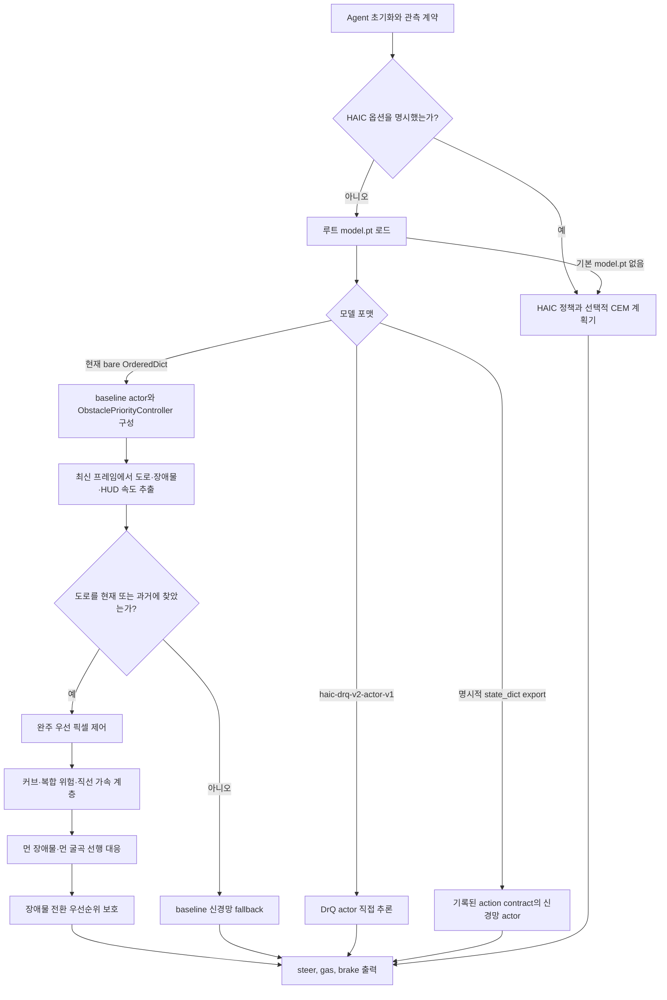

# 현재 에이전트 제어 전략 코드 보고서

- 작성 기준일: 2026-09-29
- 코드 기준: `feature/DG-Codex`의 `d9afae996a8ec86fd53b57721cffb105dc24fb11`
- 범위: 현재 루트 `agent.py`, `model.pt`, `submission.zip`, `CONTEXT.md`, 관련 실험 결과와 패키지 테스트를 읽어 실제 기본 실행 경로를 정리했다.
- 검증 범위: 이번 작성 과정에서는 새 주행, 학습, 공식 서버 확인 또는 제출을 하지 않았다. 루트 ZIP은 읽기 전용으로 파일 목록과 내장 파일 해시만 확인했다.
- 역할: 이 문서는 현재 코드가 선택하는 제어 전략의 설명서다. 실험 승인과 후보 지위는 `CONTEXT.md` 및 개별 `experiments/*-result.json`을 우선한다.

## 요약

현재 루트 `model.pt`는 포맷 메타데이터가 없는 과거 baseline의 bare `OrderedDict`다. `Agent`는 이 파일을 읽으면 신경망 actor도 구성하지만, 화면에서 도로를 한 번 찾은 뒤에는 그 가중치 대신 **`_ObstaclePriorityController`라는 결정론적 카메라 기반 제어기**를 실질 정책으로 사용한다. 따라서 현재 기본 에이전트는 학습 actor와 규칙 기반 제어기를 상황별로 계속 혼합하는 구조가 아니라, 초기 도로 미검출 시에만 신경망 fallback이 가능하고 이후 주행은 픽셀 휴리스틱이 담당하는 구조다.

제어기는 최근 네 장의 `84×84` 회색조 관측 중 최신 프레임에서 도로 중심, 굽은 정도, HUD 속도, 밝은 장애물 후보를 계산한다. 완주 우선 기준 제어기에 장애물 인접 급커브 감속, 커브 방향 보존, 명확한 직선의 제한적 가속, 먼 장애물 조기 회피, 먼 도로 굴곡 미리보기, 그리고 미리보기와 새 장애물 명령의 충돌 방지 계층을 순서대로 합성한다.

이 현행 합성 제어기는 관련 단위·합성·임시 패키지 계약 검사를 통과했지만, 마지막 조기 장애물/굴곡 변경 뒤 실제 환경 주행은 수행하지 않았다. 단일 재사용 셀에서 완주한 근거는 더 작은 `_StableCompletionController`에 대한 것이며, 현행 제어기의 일반화·완주율·랩타임 향상을 입증하지 않는다. 저장된 판정은 `implemented-diagnostic-pass`, `INCOMPARABLE`, `ACCEPT_*_DIAGNOSTIC_ONLY`이고, 공식 확정 모델이나 SOTA가 아니다.

## 실행 흐름

이 그림의 DrQ, 명시적 baseline export, HAIC/CEM은 `Agent`가 지원하는 별도 로딩 경로다. 현재 루트 `model.pt`가 실제로 선택하는 경로는 bare baseline의 픽셀 제어 경로이며, 이들을 한 주행에서 병렬로 결합하지 않는다.

## 인식과 상태

### 1. 입력과 도로 중심 추정

- 공식 입력 계약은 `float32`, CHW `(4, 84, 84)`, 값 범위 `[0, 1]`이다. bare 제어기는 같은 형상·범위로 변환 가능한 입력도 받아들이며, 인식에는 네 장 중 최신 프레임만 쓴다. 조향 이력, 장애물 통과 방향, 직전 목표 속도 같은 제어 상태는 프레임 사이에 유지한다.
- 밝기 `0.24~0.52`를 아스팔트 후보로 보고 54, 50, 46, 42, 38, 34, 30행을 가까운 쪽부터 따라간다. 직전 중심의 좌우 17픽셀 안에서 네 픽셀 이상 찾았을 때만 그 행을 채택한다.
- 세 행 이상에서 중심을 찾으면 도로가 보인다고 판정한다. 42행과 54행의 중심 차이, 전체 행 사이의 최대 중심 변화량으로 직선과 커브를 구분한다.
- 입력이 잘못됐거나 도로를 잃으면, 도로를 한 번도 찾지 못한 초기에는 0 행동 또는 신경망 fallback을 허용한다. 이미 도로를 본 뒤에는 마지막 조향을 한 프레임당 최대 `0.07`씩 0으로 되돌리고 최대 `0.06` 브레이크를 내는 복구 행동을 사용한다.

### 2. 장애물과 속도 인식

- 장애물 후보는 밝기 `0.54` 이상이고 22~61행에 있는 연결 성분이다. 면적 4~80픽셀, 폭 2~9, 높이 2~10 조건을 만족하고 추정 도로 중심에서 좌우 24픽셀 안인 후보 중 화면에서 가장 아래의 성분을 고른다.
- 장애물 중심이 도로 중심 왼쪽이면 오른쪽, 오른쪽이면 왼쪽을 통과하도록 회피 방향을 잡는다. 후보 중심이 52행보다 먼 구간에서는 방향을 다시 판정할 수 있고, 52행 이상으로 가까워진 뒤에는 기존 방향을 유지한다. 장애물이 네 프레임을 초과해 보이지 않을 때 상태를 해제한다.
- 속도는 별도 차량 상태가 아니라 최신 화면의 HUD 영역 `(y=77:83, x=10:13)` 밝기 합으로 `0~80` 범위를 추정한다. 이는 특정 렌더링과 전처리에 의존하는 근사값이다.

## 행동 결정 방식

### 1. 완주 우선 기준 제어

- 기본 목표 속도는 48이다. 도로 굽음이 커질수록 `48 - 2×road_sweep`으로 낮추되 36 아래로 내리지 않는다.
- 직선 조향은 0에서 시작하고 최대 절댓값은 0.16이다. 커브에서는 먼 중심 오차와 근거리-원거리 중심 차이를 조합하며 최대 절댓값은 0.48이다.
- 조향은 프레임마다 최대 `0.07`만 바뀐다. 큰 반대 방향 명령은 바로 뒤집지 않고 먼저 0을 거쳐 진동과 역방향 전환 위험을 줄인다.
- 기본 최대 가속은 `0.08`, 최대 브레이크는 `0.28`이며 두 페달은 동시에 사용하지 않는다. 목표 속도와의 차이에 따라 강도를 단계적으로 정한다.
- 장애물이 잡히면 목표 속도는 먼 후보에서 최대 47, 가까운 후보에서 최대 40으로 제한한다. 장애물과 최저 목표 속도 36의 급커브가 겹치면 복합 위험 계층이 목표 속도를 30으로 더 낮춘다.

### 2. 커브·직선·장애물 합성 계층

- **커브 방향 보존:** 장애물 회피 편향이 현재 커브 조향을 상쇄하면 기존 커브 명령 크기의 최소 50%를 유지한다. 장애물을 피하려다 보이는 굴곡을 정면으로 지우지 않기 위한 보호다.
- **명확한 직선의 제한적 가속:** 장애물이 없고 브레이크 중이 아니며 직전 조향이 충분히 작을 때만 가속 상한을 `0.08`에서 `0.10`으로 높인다.
- **먼 장애물 조기 회피:** 직선에서 감지한 장애물은 세로 위치로 계산한 urgency를 최소 `0.50`으로 올린다. 이론상 회피 편향은 최소 `0.12`지만 최종 조향 변화 제한 때문에 첫 출력은 보통 절댓값 `0.07` 이내다.
- **먼 굴곡 미리보기:** 현재 가까운 도로는 정렬돼 있지만 30·34행이 같은 방향으로 휘면, 장애물이 없는 경우에만 해당 방향으로 `±0.05`의 작은 선행 조향을 낸다. 전역 레이싱 라인이나 트랙 기억이 아니라 현재 프레임의 먼 도로 중심만 보는 규칙이다.
- **장애물 전환 우선순위:** 직전 프레임의 `±0.05` 미리보기와 새 장애물 회피가 반대 방향일 때, 조향 slew 상태가 첫 장애물 명령을 약화하지 않도록 미리보기 이전 장애물 제어의 명령을 복원한다. 같은 방향 전환과 비장애물 장면은 그대로 둔다.

## 모델·런타임·패키지 구분

`Agent`는 네 로딩·실행 분기를 지원하지만 현재 선택 상태는 서로 다르다.

- **현재 루트 bare baseline:** `model.pt`가 메타데이터 없는 `OrderedDict`이므로 `_ObstaclePriorityController`를 붙인다. 도로를 찾은 뒤에는 신경망 가중치가 실질 행동을 결정하지 않는다.
- **DrQ export:** `format == haic-drq-v2-actor-v1`인 명시적 actor는 픽셀 제어기로 보내지 않고 feed-forward actor 출력을 공식 세 차원 행동으로 변환한다. 진행 중인 augmentation padding 연구도 이 별도 경로에 속한다.
- **명시적 baseline export:** 최상위 `state_dict`와 action contract가 있는 export는 기록된 입력 채널·행동 표현·smoothing을 검증한 뒤 신경망 actor를 사용하며 bare용 픽셀 제어기를 붙이지 않는다.
- **HAIC policy/dynamics:** `policy.pt`와 선택적 `dynamics.pt`를 사용하는 별도 경로다. CEM 계획기가 켜져 있으면 4.5초 이내에 계획 결과를 시도하고, 실패하거나 시간이 부족하면 정책 평균 행동으로 돌아간다.

현재 루트 `submission.zip`은 Git에 추적되지 않은 파일이다. 읽기 전용 확인 결과 루트에 `agent.py`, `model.pt`, `action_smoothing.py`, `action_representation.py`가 있고, 네 내장 파일은 현재 작업 트리 파일과 일치한다. ZIP SHA-256은 `dd36876a...`, 내장 `agent.py`는 `ed079457...`다. 이는 `CONTEXT.md`에 남은 이전 ZIP `1232f763...`/agent `fbac3fda...` 기록이 현재 파일 상태보다 낡았음을 뜻한다. 그러나 immutable manifest나 공식 제출 receipt가 없으므로 현재의 내용 일치도 공식 제출·평가 결과와의 결속을 뜻하지 않는다.

## 확인된 사실과 해석

### 확인된 사실

- 현재 루트 `model.pt`는 bare `OrderedDict`이며 기본 `Agent()`는 `_ObstaclePriorityController`를 선택한다.
- `_ObstaclePriorityController`는 `_StableCompletionController` 위에 여섯 개의 제한된 수정 계층을 합성한 최종 bare 경로다.
- `_StableCompletionController`는 재사용한 단일 track 1/seed 42에서 356 decisions, progress `0.964664`, 28.4초, damage 0, collision 0으로 완주했다. 이는 구현 복원 진단이다.
- 현행 조기 장애물·먼 굴곡·전환 보호 변경은 합성 검사와 관련 테스트를 통과했지만 환경 주행 수는 0이다. 최종 관련 테스트 모음 기록은 159 passed이고, 최종 전환 subclass 직전 broad 테스트 모음은 386 passed, 10 skipped다.
- submission-5 영상 표시는 Track 1 27.50초 완주, Track 2 32.96초 완주, Track 3 19.4%에서 충돌 한도 DNF를 보이지만, 영상과 현재 후보 코드의 공식 receipt 결속은 없다.

### 해석

현재 전략은 신경망 성능을 신뢰해 전 구간을 위임하기보다, 한 번 재현된 작은 완주 우선 제어기를 기준으로 두고 영상에서 관찰된 약점에 대해 **국소적이고 상한이 있는 픽셀 규칙**을 덧붙이는 방식이다. 가장 중요한 설계 원칙은 빠른 레이싱 라인보다 도로 유지와 완주이며, 새 선행 조향이 장애물 회피를 방해할 때 장애물 명령을 우선한다.

다만 계층이 추가될수록 상태 상호작용과 회색조 임계값 의존성이 커진다. 현행 코드는 구조적으로 설명 가능하고 패키징 가능하지만, 성능 측면에서는 마지막 환경 실행이 없는 가설 상태다. 특히 top-down 영상에서 장애물이 일찍 보였다는 사실은 정책 카메라의 정확한 감지 시점이나 실패 원인을 증명하지 않는다.

### 미확인 사항

- 현행 `_ObstaclePriorityController`가 Track 3 충돌을 줄이는지, Track 1·2 시간을 유지하거나 개선하는지.
- 새로운 geometry seed와 모든 `track_id`에서의 완주율, 진행률, 손상 및 랩타임.
- 로컬 Windows 검사를 넘어 공식 Linux 제출 컨테이너와 서버에서의 자원 제한·동작 적합성.
- 진행 중인 DrQ pad-1 대 pad-4 연구 결과와 bare 픽셀 제어기의 동일 평가 셀 직접 비교.
- 루트 `submission.zip`이 실제 제출된 어떤 영상·서버 결과와도 공식적으로 연결되는지.

## 참고 코드와 기록

- [`agent.py`](agent.py) — 모델 포맷 분기, `_StableCompletionController`와 최종 `_ObstaclePriorityController`, `act()` 라우팅.
- [`model.pt`](model.pt) — 현재 bare baseline state dict.
- [`CONTEXT.md`](CONTEXT.md) — 현행 목표, 동결 계약, DrQ 연구와 bare runtime 근거의 최신 상태.
- [`experiments/stable-completion-controller-v1-result.json`](experiments/stable-completion-controller-v1-result.json) — 작은 기준 제어기의 단일 재사용 셀 완주 및 구현 parity 근거.
- [`experiments/stable-compound-corner-speed-v1-result.json`](experiments/stable-compound-corner-speed-v1-result.json) — 장애물 인접 급커브 감속 계층.
- [`experiments/stable-curve-obstacle-arbitration-v1-result.json`](experiments/stable-curve-obstacle-arbitration-v1-result.json) — 커브와 장애물 조향 중재 계층.
- [`experiments/stable-clear-straight-throttle-v1-result.json`](experiments/stable-clear-straight-throttle-v1-result.json) — 명확한 직선 가속 계층.
- [`experiments/guarded-distant-obstacle-preposition-v1-result.json`](experiments/guarded-distant-obstacle-preposition-v1-result.json) — 먼 장애물 조기 회피 진단.
- [`experiments/guarded-distant-bend-preview-v1-result.json`](experiments/guarded-distant-bend-preview-v1-result.json) — 먼 굴곡 미리보기와 안전 검토.
- [`experiments/anticipatory-obstacle-transition-priority-v1-result.json`](experiments/anticipatory-obstacle-transition-priority-v1-result.json) — 미리보기 직후 장애물 명령 우선순위 보호.
- [`tests/test_submission_policy.py`](tests/test_submission_policy.py), [`tests/test_submission_package.py`](tests/test_submission_package.py) — bare 라우팅과 패키지 실행 계약 검사.
