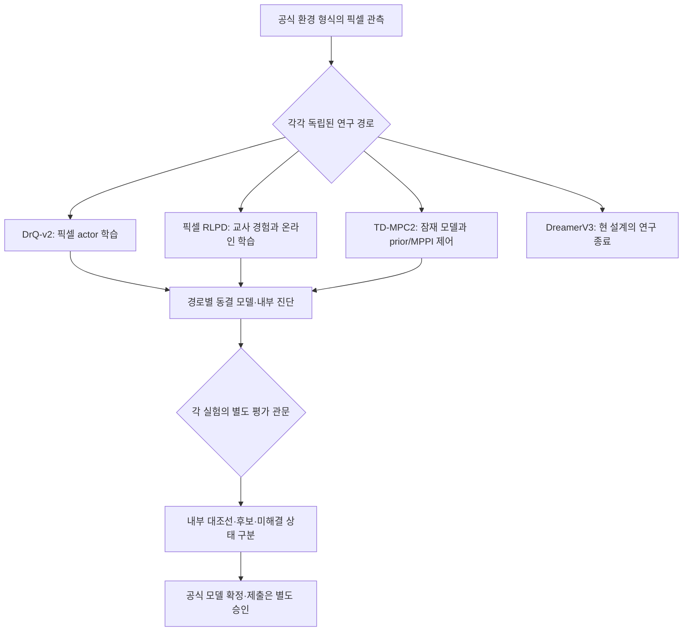

# 현재 연구·봇 제어 전략 코드 보고서

- 작성 기준일: 2026-09-29
- 범위: 현재 `main`의 [연구 상태](current-state.md), [아키텍처](../architecture/overview.md), [모델 상태](../results/MODEL_STATUS.md)와 기존 실험 기록을 읽어 요약했다. 새 주행, 체크포인트/ZIP 검사, 공식 서버 확인은 하지 않았다.
- 역할: 독자를 위한 교차 연구 경로 요약이다. 최신 연구 상태와 후보 지위의 기준 문서는 각각 [`current-state.md`](current-state.md)와 [`MODEL_STATUS.md`](../results/MODEL_STATUS.md)이며, 이 보고서는 이를 대체하지 않는다.
- 읽는 법: 팀원 보고서와 같은 양식을 쓰되, 우리 쪽에는 **하나의 선정된 현행 봇 패키지가 아니라 독립적인 연구 경로들**이 있으므로 아래 그림은 단일 에이전트의 실행 그래프가 아니라 연구·검증의 개요다.

## 요약

현재 연구는 화면 이미지를 보고 행동을 정하는 **DrQ-v2 및 픽셀 RLPD 정책**, 이미지에서 미래를 예측해 행동을 고르는 **TD-MPC2 모델 기반 제어**를 별개의 경로로 다룬다. DreamerV3 경로는 현재 설계와 예산 아래에서 종료됐다. 팀원 브랜치의 `full-road-guard`처럼 장애물 여부에 따라 학습 정책과 수동 픽셀 제어기를 전환하는 통합 실행 경로는 현재 우리 모델로 선정돼 있지 않다.

기존 내부 근거 중 RLPD seed 11은 제한된 도로 분할의 스크린·확인·블라인드 관문을 거친 **내부 후보**다. DrQ-v2 pad-4 대조선은 유효한 내부 기준점이지만, 후속 보존 학습은 기존 성공을 충분히 유지하지 못했다. TD-MPC2의 긴 학습은 작동했으나 저장된 최종 모델을 재사용 TRAIN 도로에서 따로 평가했을 때 완주하지 못했다. 공식 선정·확정 모델이나 서버 결과는 기록돼 있지 않다.

## 연구와 평가 흐름

그림의 화살표는 세 정책을 한 에이전트 안에서 교대 실행한다는 뜻이 아니다. 평가 셀과 관문도 연구별 프로토콜이 다르다. 특히 재사용한 TRAIN 도로의 TD 진단을 RLPD의 내부 블라인드와 동등하게 취급하지 않는다.

## 인식과 행동 방식

### 1. 픽셀에서 직접 행동을 배우는 경로

- **DrQ-v2:** 이미지에서 조향·페달 행동을 출력하는 학습 정책이다. pad-4 대조선이 내부 기준이고, 도로 기하 구성을 달리한 후속 학습은 기존 성공 사례 보존 문제를 드러냈다. 최종-source replay 재구성은 일부 학습 arm만 끝난 채 일시정지돼 있어 새 모델을 고르지 않았다. [DrQ 계획](../plans/active/drqv2-geometry-mix-plan.md)
- **픽셀 RLPD:** 교사 경험을 이용하는 오프폴리시 학습과 환경 상호작용을 결합한다. seed 11의 한 동결 actor는 서로 다른 내부 스크린 12/24, 확인 12/32, 블라인드 9/24 완주를 기록했다. 이 분모들은 합쳐서 하나의 더 큰 검증 세트로 계산하지 않는다. V5의 다른 후보도 별도 실험·분할의 결과이며, 공식 최종 모델 선택은 아니다. [동결된 RLPD 결과](../../experiments/pixel-rlpd-long-horizon-followup-v1-result.json), [모델 상태](../results/MODEL_STATUS.md)

RLPD의 후속 완료 우선 연구는 실패 장면을 관찰했지만 픽셀만으로 안전하게 개입할 트리거를 아직 고르지 못했다. 접촉과 중심선 거리 관련 경고는 성공한 주행에서도 나타날 수 있다. G1은 준비·감사 단계이며 새 수집/학습 정책 결과는 아니다. [G0 관찰](../../experiments/rlpd-g0-completion-v1-result.json), [G0 결정](../../experiments/rlpd-g0-pixel-motion-v1-decision.json), [현재 상태](current-state.md)

### 2. 미래 행동을 모델로 고르는 경로

- **TD-MPC2:** 픽셀 관측에서 학습한 잠재 동역학·보상 예측을 바탕으로 MPPI 계획 행동을 고르고, 사전 정책 행동과도 구분해 검사한다. 긴 학습 중 후반에는 일부 주행 완주가 있었지만, 그것은 계속 업데이트되던 정책의 TRAIN 기록이다. 저장된 최종 모델의 별도 완전 에피소드 평가에서는 같은 재사용 TRAIN 도로에서 prior 0/8, MPPI 0/8 완주였다. 두 수치를 혼동하면 안 되며 새 도로 성능을 말해 주지도 않는다. [훈련 결과](../../experiments/tdmpc2-long-reused-train-v2-100k-result.json), [동결 모델 평가](../../experiments/tdmpc2-full-consumed-train-v1-result.json)
- 손상 증가를 학습 보상에서만 벌주는 별도 100k 실험은 완료됐다. 계속 갱신되던 TRAIN 정책은 10/286회 완주했지만, 별도 동결 정책 평가는 같은 네 재사용 도로에서 prior 0/8, MPPI 2/8이었고 두 MPPI 완주는 모두 같은 도로의 반복 주행이었다. 사전 선언된 로컬 MPPI 기준 4/8에 미달했으며, 보상 벌점이 두 완주를 일으켰다는 인과 결론도 불가능하다. [동결 학습 결과](../../experiments/tdmpc2-damage-shaping-v1-100k-result.json), [동결 정책 평가](../../experiments/tdmpc2-damage-full-consumed-train-v1-result.json), [TD 계획](../plans/active/tdmpc2-pixel-online-baseline.md)

### 3. 종료한 경로

- **DreamerV3:** 현재 설계·예산에서는 다단계 자유 예측 개선 관문을 통과하지 못해 연구를 닫았다. 남은 체크포인트는 세계 모델 진단용으로, 운전 가능한 학습 actor나 선정 모델이 아니다. 이는 DreamerV3 일반에 대한 불가능성 판정이 아니다. [종료 판단](current-state.md)

## 런타임과 모델 상태의 구분

저장소의 `agent.py`가 여러 모델 형식을 읽을 수 있다는 사실과, **특정 모델이 하나의 선택된 제출 패키지로 포장·검증됐다는 사실**은 다르다. 과거 로컬 패키지 기록은 현재 RLPD/TD/DrQ 중 공식 제출 모델이 선정됐다는 증거가 아니다. 특히 TD-MPC2의 연구 추론 경로와 팀원 브랜치의 CEM 비활성화 패키지 경로를 같은 실행 설정이라고 볼 수 없다. 모델 선정 현황은 [모델 상태 문서](../results/MODEL_STATUS.md), 실행 구조는 [아키텍처 개요](../architecture/overview.md)를 기준으로 읽는다.

## 확인된 사실과 해석

### 확인된 사실

- DrQ-v2는 내부 대조선이며 보존 후속 연구의 최종 진단은 아직 끝나지 않았다.
- RLPD seed 11은 내부 후보이고, 별도 G1 개입 정책은 아직 없다.
- TD-MPC2의 저장 모델 결과와 훈련 중 결과는 서로 다른 근거이며, 재사용 TRAIN 도로만으로 신선한 일반화를 주장할 수 없다.
- DreamerV3 경로는 종료됐고 공식 선정·확정 모델은 없다.

### 해석

지금의 전략은 한 제어 구조를 최종 답으로 고정하기보다 **독립적인 후보를 전체 에피소드 완주와 분리된 평가 셀로 검증하는 것**이다. 장애물 특화 보조 제어는 [팀원 전략 비교](teammate-strategy-comparison-2026-09-29.md)에서 조건부 연구 가설로만 정리했다. 후속 개입의 이득이나 알고리즘 간 우열은 아직 입증되지 않았다.

### 미확인 사항

- 새로운 도로에서 여러 후보를 동일 조건으로 비교한 단일 모델의 일반화 우열.
- 별도로 준비 중인 TD-MPC2 H=5 무-reset 진단과 계획기 전용 평가의 결과, DrQ 후속 연구의 최종 보존 관문, RLPD G1의 실행 결과.
- 현재 내부 후보의 공식 서버 제출·모델 확인 결과. 외부 행동은 별도 승인이 필요하다.

## 참고 코드와 기록

- `agent.py`, `docs/architecture/overview.md` — 실행 진입점과 모델 계열의 경계.
- `haic/algorithms/`, `docs/plans/active/` — 알고리즘별 구현·진행 계획; 세 경로를 하나의 정책으로 합치는 정의는 아니다.
- `docs/context/current-state.md`, `docs/results/MODEL_STATUS.md`, `docs/experiments/INDEX.md` — 상태 요약, 후보 상태, 실험 근거로 가는 길잡이.
- `docs/evaluation/generalization-policy.md` — TRAIN/스크린/확인/블라인드 및 공식 근거의 구분.
