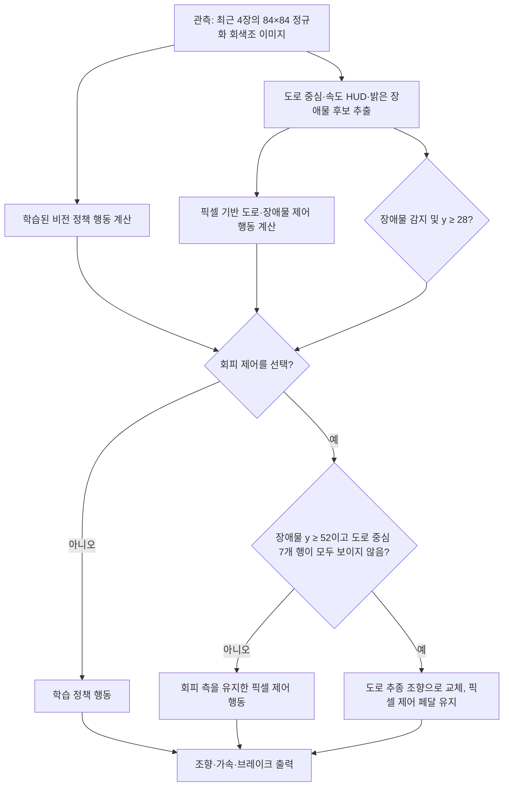

# 현재 봇 제어 전략 코드 보고서

- 작성 기준일: 2026-09-28
- 범위: 저장소의 실행 코드와 선택 패키지 생성 코드를 읽어 정리했다. 주행 평가, 체크포인트 파일, 기존 `runs/`, `artifacts/haic/`, `submissions/` 내용은 이 보고서의 근거로 열거나 재평가하지 않았다.

## 요약

현재 상태 문서는 선택된 로컬 패키지를 `full-road-guard`로 기록한다. 그 패키지 생성 코드를 기준으로 보면 봇은 **학습된 픽셀 정책과 결정론적 픽셀 회피 제어기를 결합한 하이브리드 방식**이다. 장면을 보고 전체 트랙 지도를 만들거나 시뮬레이터의 차량·장애물 좌표를 읽는 구조가 아니라, 각 관측 이미지에서 가까운 도로 중심과 밝은 장애물 후보를 찾아 그 순간의 행동을 정한다.

선택 패키지에서는 학습 정책의 행동 계획기(CEM)를 끄고, 장애물이 없거나 아직 회피 제어 범위에 들어오지 않았을 때 학습 정책을 사용한다. 장애물이 감지되어 이미지 y=28 이상인 회피 제어 범위에 들어오면 픽셀 기반 도로·장애물 제어기가 행동을 대신한다. 장애물이 화면 가까이에 있는데 도로 윤곽이 충분히 보이지 않으면 장애물 쪽 급조향을 억제하고 도로 추종 조향으로 바꾼다.

## 실행 흐름

회색조 입력을 만드는 로컬 래퍼는 화면을 84×84로 줄이고, 0~1 범위로 정규화한 뒤 최근 네 프레임을 쌓는다. 패키지 진입점은 기본 에이전트와 `ObstacleFullRoadGuardAgent`를 함께 만들고, `reset`과 `act`를 이 회피 제어기에 전달한다.

## 인식과 행동 방식

### 1. 화면에서 도로와 장애물 찾기

- 도로 후보는 회색조 값 0.24~0.52인 픽셀이다. 이미지의 54, 50, 46, 42, 38, 34, 30행을 훑으며 직전 중심에서 가로 ±17픽셀 안에 후보가 네 픽셀 이상 있을 때 해당 행의 도로 중심으로 채택한다.
- 장애물 후보는 회색조 값 0.54 이상인 작은 연결 영역이다. 22~61행 안에서 넓이·높이·픽셀 수 조건을 통과하고, 추정 도로 중심에서 가로 12픽셀 이내인 후보만 남긴다. 후보가 여러 개면 화면에서 가장 아래에 있는 것을 가까운 장애물로 취급한다.
- 속도는 차량 상태값 대신 화면 하단 HUD의 작은 밝기 영역을 읽어 추정한다. 네 프레임 중 최근 두 프레임의 판독값을 평균한다.

따라서 코드의 ‘맵’은 전역 경로 지도라기보다 매 프레임 다시 계산하는 짧은 시야의 도로 중심선과 장애물 위치 추정이다.

### 2. 기본 행동과 회피 행동

- 학습 정책은 4프레임 이미지를 CNN으로 처리해 조향과 종방향 제어값을 낸다. 종방향 값은 부호에 따라 가속 또는 브레이크로 바뀌므로 두 페달을 동시에 내지 않는다.
- 픽셀 제어기는 먼 쪽 도로 중심과 가까운 쪽 중심의 차이를 이용해 조향하고, 도로 중심선 변화량으로 커브 정도를 추정해 목표 속도를 낮춘다. 기본 목표 속도 상한은 62이며, 장애물이 잡히면 거리 구간에 따라 47 또는 40으로 제한한다.
- 장애물 중심이 도로 중심의 왼쪽이면 오른쪽으로, 오른쪽이면 왼쪽으로 회피 조향을 더한다. 장애물이 화면 아래쪽으로 다가올수록 조향 보정이 커진다.
- 장애물이 움직이거나 원근 때문에 화면상 좌우 위치가 바뀌어도 한 번 고른 회피 방향을 유지하도록 보정한다. 장애물이 두 프레임 연속 보이지 않으면 방향 고정을 해제한다. 화면 위쪽에서 장애물 위치 차이가 1~4픽셀로 판독되면 회피 방향을 미리 정하는 경로도 있다.
- 장애물이 이미지의 y=52 이상에 있고 도로 중심을 일곱 행 모두에서 찾지 못하면, 회피 조향 대신 도로 추종 조향을 쓴다. 이 보호 단계는 가속·브레이크 값은 바꾸지 않는다.

픽셀 회피 제어기가 선택되는 기준은 검출된 장애물의 이미지 y가 28 이상인지 여부다. 그보다 위에 있는 동안은 학습 정책의 행동을 출력하되, 일부 상황에서는 이후 회피에 쓸 방향 상태를 미리 갱신한다.

## 런타임 구분

저장소 루트의 `agent.py`를 기본 설정 그대로 직접 실행하는 경로와 선택된 `full-road-guard` 패키지 경로는 다르다. 루트 설정은 CEM 계획기를 활성화하지만, 선택 패키지 생성 코드는 기본 에이전트에 `planner_enabled=False`와 엄격한 체크포인트 로딩을 지정한다. 따라서 이 패키지 경로에서는 동역학 모델로 미래 행동을 탐색하지 않는다. 선택 패키지의 정책 행동과 픽셀 회피 행동을 위 규칙으로 고른다.

## 확인된 사실과 해석

### 확인된 사실

- 상태 문서는 `full-road-guard` ZIP을 현재 선택된 로컬 패키지로 표시한다.
- 패키지 생성 코드는 학습 정책을 `ObstacleFullRoadGuardAgent`로 감싸고, 패키지 실행에서 CEM을 끈다.
- 회피 계층은 도로 중심·속도 HUD·밝은 장애물 후보를 관측 픽셀에서 계산한다.
- 체크포인트 로더는 체크포인트 metadata에 따라 HUD crop, 추가 시각 특징, 시간 특징 사용 여부를 정한다.

### 해석

전략의 중심은 학습 정책 하나가 전 구간을 운전하는 것이 아니라, 장애물 상황에서 규칙 기반 픽셀 제어가 행동을 덮어쓰는 데 있다. 장애물 회피와 불완전한 도로 윤곽에 대한 보호는 코드에 명시돼 있지만, 임계값은 렌더링 픽셀에 맞춘 휴리스틱이다. 코드 구조만으로 인식 신뢰도나 실제 주행 성능을 단정할 수는 없다.

### 미확인 사항

- 실제 체크포인트의 metadata와 가중치를 열지 않아 정책의 HUD·시각 특징·시간 특징 분기 중 무엇이 활성화되는지는 여기서 확인하지 않았다.
- 선택 ZIP 자체를 열어 내부 파일 해시를 대조하지 않았다. 이 보고서는 상태 문서의 선택 표시와 현재 패키지 생성 소스에 근거한다.
- 이 문서는 코드 경로 설명이며, 해당 코드가 특정 맵에서 잘 작동하는지에 대한 검증이나 공식 적합성 판정은 아니다.

## 참고 코드

- `docs/report.md` — 선택된 로컬 ZIP의 현재 상태
- `research/package_full_road_guard_20260928.py` — 패키지 진입점 및 패키지용 planner 설정
- `agent.py`, `haic_agent/runtime_config.py`, `haic_agent/networks.py` — 기본 정책, 기본 런타임, 신경망 행동 변환
- `env_wrapper.py` — 이미지 전처리와 프레임 스택
- `haic_agent/pixel_features.py`, `haic_agent/corridor_agent.py` — 도로·장애물·속도 인식 및 픽셀 제어
- `haic_agent/obstacle_commit_runtime.py`, `haic_agent/obstacle_commit_late_runtime.py`, `haic_agent/obstacle_road_guard_runtime.py`, `haic_agent/obstacle_side_evidence_runtime.py`, `haic_agent/obstacle_full_road_guard_runtime.py` — 회피 방향 유지와 도로 가시성 보호 계층
